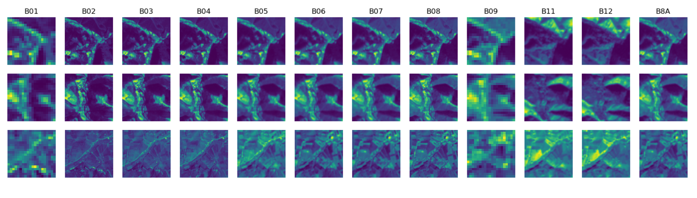
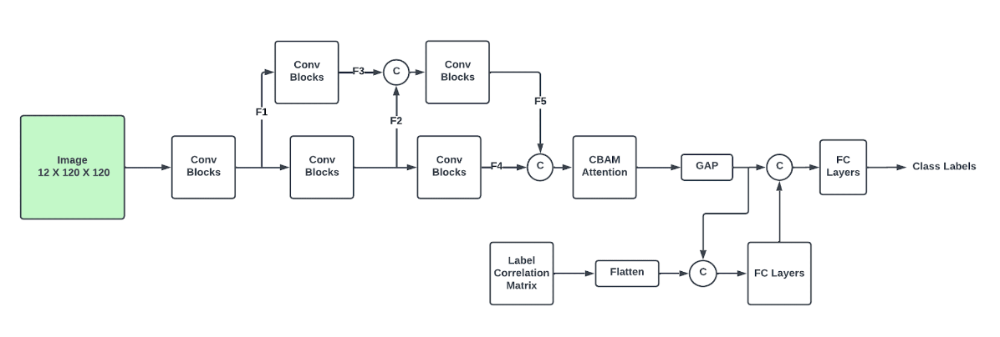
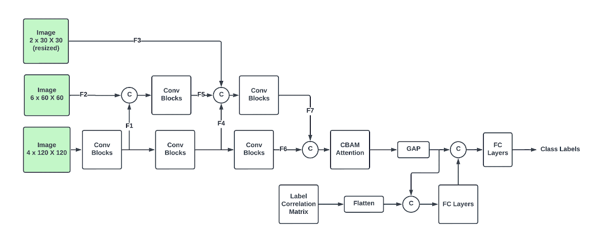
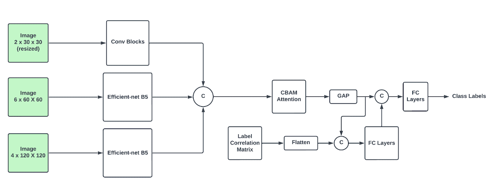
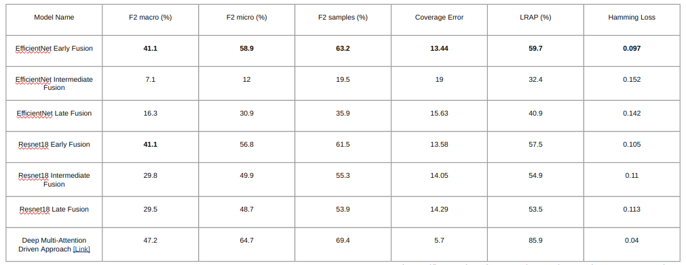

# LandUseLandCoverMultiLabelClassification

## Motivation

Regular observation of the earth to tackle some of the following problems:   
1. Understanding land use dynamics  
2. Resource management  
3. Urban planning  
4. Environmental monitoring  
5. Disaster risk reduction  

## Dataset Description  
12 Bands  
Bands and pixel resolution in meters:  
60 Meter (20 x 20 pixels) - B01: Coastal aerosol | B09: Water vapor   
10 Meter (120 x 120 pixels) - B02: Blue | B03: Green | B04: Red | B08: NIR  
20 Meter (60 x 60 pixels) - B05: Vegetation red edge | B06: Vegetation red edge | B07: Vegetation red edge | B8A: Narrow NIR | B11: SWIR | B12: SWIR 

https://bigearth.net/static/documents/Description_BigEarthNet-S2.pdf  
https://www.tensorflow.org/datasets/catalog/bigearthnet  

## Few examples 
  

## Preprocessing using Datadings

Accessing tiny files in separate directories is slow.  
Accessing data over the network attached storage slows this further.  
Converting Train, Test and Val splits to datadings files for faster training.  
Link: https://datadings.readthedocs.io/en/latest/index.html  

## 3 Experiments

1. <b>Resizing all Bands to 120X120</b>  
  
2. <b>Intermediate Fusion</b>  
    
3. <b>Late Fusion</b>  
  

## Classification Results
  
Deep Multi-Attention Driven Approach paper: https://ieeexplore.ieee.org/stamp/stamp.jsp?tp=&arnumber=9096309